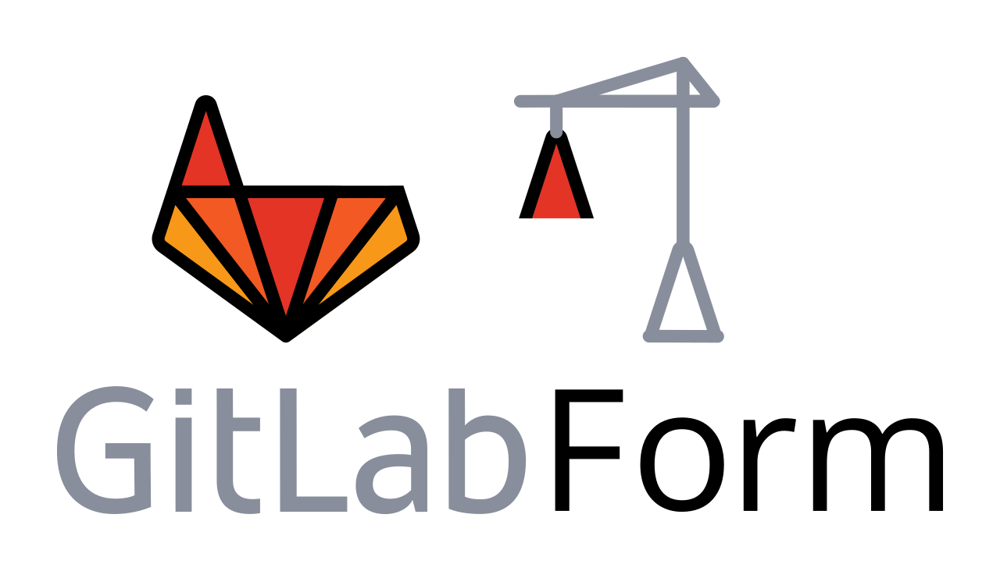

[](https://badge.fury.io/py/gitlabform)

[](https://pepy.tech/project/gitlabform)
[](https://github.com/psf/black)
[](https://codecov.io/gh/gitlabform/gitlabform)
[](https://snyk.io/advisor/python/gitlabform)

<figure markdown>
  
</figure>

is a specialized configuration as a code tool for GitLab:

* application settings,
* groups,
* projects,

...and more using hierarchical configuration written in YAML.


## Why?

### Short and powerful syntax

A lot of features with a little amount of YAML thanks to the [hierarchical configuration with inheritance, merging/overwriting and additivity](reference/index.md#effective-configuration) .
```yaml
projects_and_groups:
  # configuration shared by all projects in a group named 'a_group'...
  a_group/*:
    merge_requests_approvals:
      disable_overriding_approvers_per_merge_request: true
  # ...except this project that has a different config:
  a_group/a_special_project:
    merge_requests_approvals:
      disable_overriding_approvers_per_merge_request: false
```

### Dynamic features

GitLab introduces new features monthly. You can often use them in GitLabForm without upgrading the app because we [pass some parameters as-is to GitLab APIs with PUT/POST requests](reference/index.md#raw-parameters-passing).
```yaml
projects_and_groups:
  a_group/a_project:
    project_settings:
      # ALL the keys described at
      # https://docs.gitlab.com/ee/api/projects.html#edit-project
      # can be provided here
```

### Stability

We treat our users the way we would like to be treated by other software projects maintainers:

* We follow [semver](https://semver.org/) and don't allow _existing features behavior changes_ in minor or patch versions.
* Before changing the syntax we start printing _deprecation warnings_ in the versions before.
* We use _versioning of the configuration syntax_ for major changes and provide step-by-step upgrade guidelines.

## Quick start

Let's assume that you want to add a deployment key to all projects in a group "My Group" (with path "my-group").
If so then:

1. Create a `config.yml` file with:

```yaml
config_version: 3

gitlab:
  url: https://gitlab.yourcompany.com
  # alternatively use the GITLAB_TOKEN environment variable for this
  token: "<private token OR an OAuth2 access token of an admin user>"

projects_and_groups:
  my-group/*:
    deploy_keys:
      a_friendly_deploy_key_name:  # this name is only used in GitLabForm config
        key: ssh-rsa AAAAB3NzaC1yc2EAAAADAQABAAABAQC3WiHAsm2UTz2dU1vKFYUGfHI1p5fIv84BbtV/9jAKvZhVHDqMa07PgVtkttjvDC8bA1kezhOBKcO0KNzVoDp0ENq7WLxFyLFMQ9USf8LmOY70uV/l8Gpcn1ZT7zRBdEzUUgF/PjZukqVtuHqf9TCO8Ekvjag9XRfVNadKs25rbL60oqpIpEUqAbmQ4j6GFcfBBBPuVlKfidI6O039dAnDUsmeafwCOhEvQmF+N5Diauw3Mk+9TMKNlOWM+pO2DKxX9LLLWGVA9Dqr6dWY0eHjWKUmk2B1h1HYW+aUyoWX2TGsVX9DlNY7CKiQGsL5MRH9IXKMQ8cfMweKoEcwSSXJ
        title: ssh_key_name_that_is_shown_in_gitlab
        can_push: false
```

Alternatively, create a `config.yml` file with setting `GITLAB_URL` & `GITLAB_TOKEN` as environment variables

```yaml
config_version: 3

projects_and_groups:
  my-group/*:
    deploy_keys:
      a_friendly_deploy_key_name:  # this name is only used in GitLabForm config
        key: ssh-rsa AAAAB3NzaC1yc2EAAAADAQABAAABAQC3WiHAsm2UTz2dU1vKFYUGfHI1p5fIv84BbtV/9jAKvZhVHDqMa07PgVtkttjvDC8bA1kezhOBKcO0KNzVoDp0ENq7WLxFyLFMQ9USf8LmOY70uV/l8Gpcn1ZT7zRBdEzUUgF/PjZukqVtuHqf9TCO8Ekvjag9XRfVNadKs25rbL60oqpIpEUqAbmQ4j6GFcfBBBPuVlKfidI6O039dAnDUsmeafwCOhEvQmF+N5Diauw3Mk+9TMKNlOWM+pO2DKxX9LLLWGVA9Dqr6dWY0eHjWKUmk2B1h1HYW+aUyoWX2TGsVX9DlNY7CKiQGsL5MRH9IXKMQ8cfMweKoEcwSSXJ
        title: ssh_key_name_that_is_shown_in_gitlab
        can_push: false
```

2. Run:
```shell
docker run -it -v $(pwd):/config ghcr.io/gitlabform/gitlabform:latest gitlabform my-group
```
3. Watch GitLabForm add this deploy key to all projects in "My Group" group in your GitLab!

## Used by

<a href="https://www.egnyte.com" target="_blank"></a>
<a href="https://www.elasticpath.com" target="_blank"></a> ...and many more!

## License

The app code is licensed under the [MIT](https://github.com/gitlabform/gitlabform/blob/main/LICENSE) license.
A few scripts in `dev/` directory are licensed under the [MPL 2.0](http://mozilla.org/MPL/2.0/) license.


GitLab is a registered trademark of GitLab, Inc. This application is not endorsed by GitLab and is not affiliated with GitLab in any way.

The GitLabForm logo is based on the GitLab logos available [here](https://about.gitlab.com/press/),
and like the original art is licensed under the
[Creative Commons Attribution Non-Commercial ShareAlike 4.0 International License](https://creativecommons.org/licenses/by-nc-sa/4.0/).


All the logos shown in the "Home" section of this documentation belong to their respective owners.
